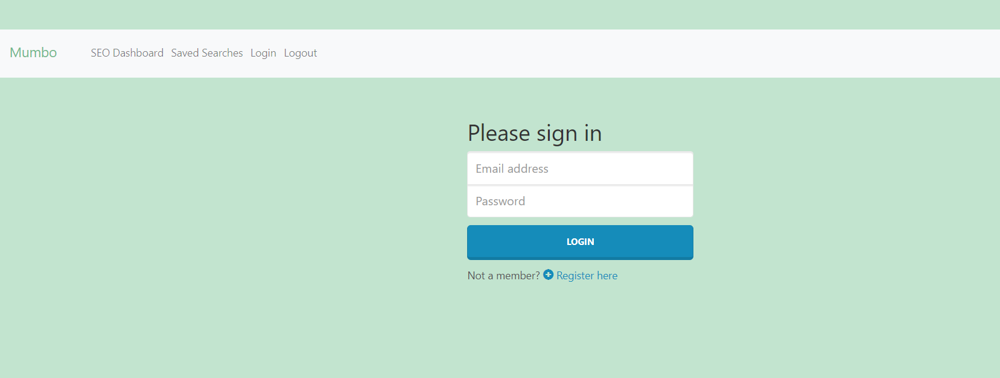
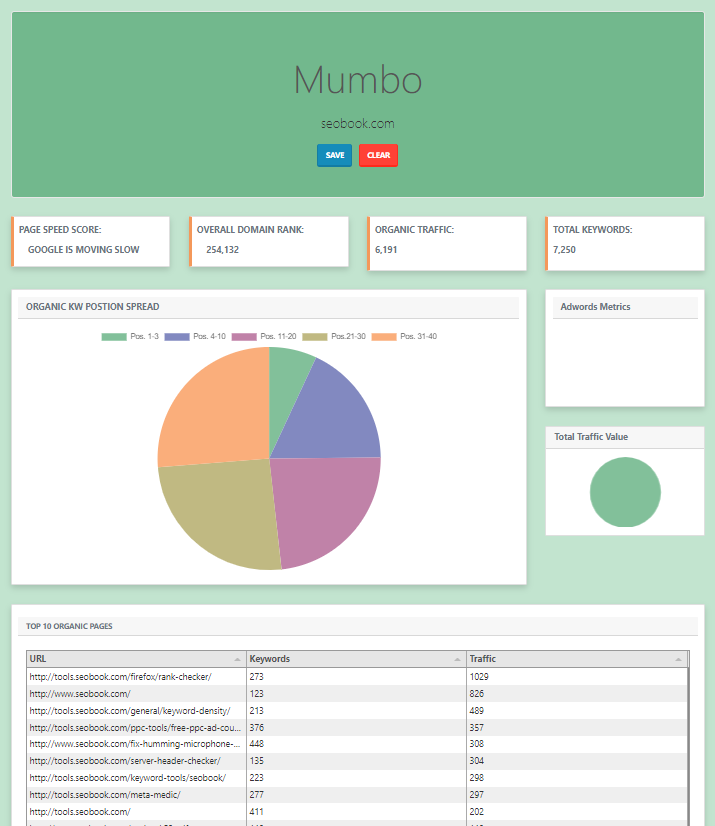
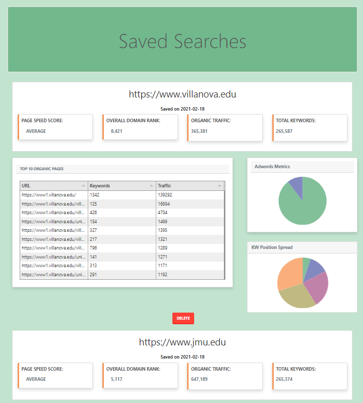

## SEO Mumbo - Organize all Your SEO Mumbo Jumbo 
This application allows for advanced SEO Specialists to manage multiple websites in one easy-to-use location. Using different npm installs, API routes, and a mongoose database, we are able to host all-important SEO information on this application. 
 
## Links

Deployed Application: https://seo-mumbo.herokuapp.com/

QRCode: 

Video: https://drive.google.com/file/d/1F94uR24BYYXqXJHtDNkmp_9w0zyZrli7/view 

 
## Technologoies 
<ul>
    <li>Bootstrap</li>
    <li>React</li>
    <li>React Router</li>
    <li>Charts.JS</li>
    <li>Tabulator</li>
    <li>Axios</li>
    <li>Mongo Database</li>
    <li>Mongoose</li>
    <li>Passport</li>
    <li>Express</li>
</ul>
 
## Description
 
The SEO Mumbo application was created to make organizing multiple websites for SEO Specialists more efficient but providing a high overview of all saved URLs in one location. Using the SEMrush and Google Page Speed API, the application calls detailed information such as Page Speed Score, Domain Authority, Organic Traffic, and Total Organic Keywords. After making the initial call, SEO specialists are able to save the information to a database and refer back to it as needed just by simply logging in. 
 
SEO Mumbo starts by requiring that you create a login with an email and password to ensure that the following information is secure. Although you will be able to access the SEO Dashboard without login, you will not be able to save any information. The login and register pages were created using passport and JWTokens. After beginning in, your information is then saved to a database where we have used JwtToken to track and save your login information. 
 
Once you log in, we recommend heading to the SEO Dashboard to enter your first website. On the dashboard, all information appended until you click the search button. Once you enter your website containing the 'http://' or 'https://' then you will be able to see the following SEO data pulled from the Google Page Speed API (which takes a while) and the SEMRush API. We also used charts.JS and Tabulator to create a user-friendly experience. 
 
After you have reviewed all the SEO data from the third-party API calls, you are able to save that information to the database. We did this by creating an object that holds all the data, then saving it to the Mongoose database. Once in the Mongoose database, it is then pull through a get request and passed through all the same elements on the dashboard, but this time without calling the third-party APIs. We have also implemented a delete route, so you can remove the URL data that you are no longer working on.

## License
This application is licensed under the MIT License.

## Questions
If you have any questions, please reach out to: 

Jesse Larsen - larsenj732@gmail.com

Krista Meiers - krista.coding@gmail.com

## Images
Login page 

SEO Dashboard

Saved Searches

